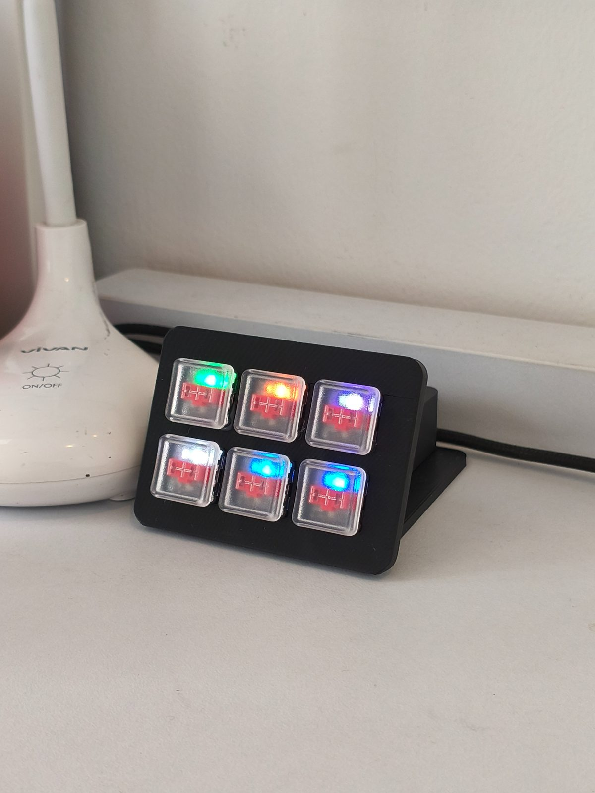

# Scene Switch

A 6-button ESP32 scene controller with Kailh Choc switches and per-button WS2812B LED feedback, built for Home Assistant.

## Features

- 6 physical buttons, each with single/double/long-click detection
- Per-button addressable LED with color feedback (partitioned from a single LED strip)
- Soft white "click" pulse on every press for tactile feedback, independent of whatever effect/color is currently running
- Custom LED effects: Rainbow Flow, Meteor Flow, Knight Rider, Police Strobe, Color Wipe, Button Colors
- Boot LED sweep test on startup
- WiFi with primary + fallback SSID, plus local AP fallback if both fail
- Remembers and restores the last color/effect after a WiFi disconnect (shows an amber "breathing" indicator while disconnected)
- OTA updates with safe-mode rollback protection

## Setup

1. Copy `secrets_example.yaml` to `secrets.yaml` and fill in your own WiFi credentials, OTA password, and AP fallback password.
2. Generate a 32-byte base64 API encryption key using one of these terminal commands and add it to your `secrets.yaml`:
   - **Python**: `python -c "import secrets; import base64; print(base64.b64encode(secrets.token_bytes(32)).decode())"`
   - **PowerShell**: `$bytes = New-Object Byte[] 32; [Security.Cryptography.RNGCryptoServiceProvider]::Create().GetBytes($bytes); [Convert]::ToBase64String($bytes)`
3. Adjust GPIO pin assignments in `sceneswitch.yaml` if your wiring differs.
4. Flash via USB for the first install:
   ```bash
   esphome run sceneswitch.yaml
   ```
5. Subsequent updates can be done over OTA once the device is on your network.

## Optional Plugins

This project uses ESPHome's `packages:` feature to keep optional functionality in separate files instead of bloating `sceneswitch.yaml`. `packages:` can only *add* new globals, scripts, sensors, etc. — it can't patch existing list items (like an existing button's `on_multi_click:` block), so a plugin that needs to change existing button behavior still requires a small edit directly in `sceneswitch.yaml` (documented per-plugin below).

**Included Example Plugin (`plugins/media_mode.yaml`):**

Adds a "media mode" you can toggle by holding Button 4 (PC) + Button 6 together for ~450ms. While active, Buttons 4/5/6 send media-control events instead of their normal scene actions:

| Button | Single-click | Double-click | Long-press |
|---|---|---|---|
| 6 | Previous track | Volume down | — |
| 5 | Play/Pause | (unchanged, normal scene) | Mute |
| 4 | Next track | Volume up | — |

Entering/exiting mode gives a green double-blink confirmation, then the three LEDs stay a dim cyan while active. Two entities are also exposed to Home Assistant: `binary_sensor.scene_switch_media_mode` (on/off) and `text_sensor.scene_switch_current_mode` ("Scene" / "Media").

Requires [HASS.Agent](https://github.com/HASS-Agent/HASS.Agent) (or similar) installed on your Windows PC, exposed to HA as a `media_player` entity, plus a Home Assistant automation listening for the `esphome.scene_switch_media` event (see below) to actually route the commands to it.

**How it's wired in (already done for this plugin, shown here as a reference for writing your own):**

1. `sceneswitch.yaml` loads it via `packages:` at the top of the file:
   ```yaml
   packages:
     media_mode: !include plugins/media_mode.yaml
   ```
   Packages are always active once included — there's no toggle/uncomment step.
2. Buttons 4, 5, and 6's `on_multi_click:` blocks in `sceneswitch.yaml` each check `media_mode` (a global defined in the plugin) and branch between firing the normal `esphome.scene_switch_button` event or the plugin's `esphome.scene_switch_media` event.

To add your own plugin: create a new file under `plugins/`, add it to the `packages:` map the same way, and if it needs to change existing button behavior, edit that button's block in `sceneswitch.yaml` directly.

## Home Assistant Automation Mapping

The firmware fires Home Assistant events for each button press. Because workflows vary, **button actions are not hardcoded in ESPHome**. You must create Home Assistant automations triggered by these events.

**Example Automation — scene buttons (`esphome.scene_switch_button`):**
```yaml
alias: Scene Switch - Spotlight Gestures
triggers:
  - event_type: esphome.scene_switch_button
    event_data:
      button: spotlight
      click_type: single
    trigger: event
  - event_type: esphome.scene_switch_button
    event_data:
      button: spotlight
      click_type: double
    trigger: event
  - event_type: esphome.scene_switch_button
    event_data:
      button: spotlight
      click_type: long
    trigger: event
actions:
  - choose:
      - conditions:
          - condition: template
            value_template: "{{ trigger.event.data.click_type == 'single' }}"
        sequence:
          - action: switch.toggle
            target:
              entity_id: switch.spotlight_kamar_alief
      - conditions:
          - condition: template
            value_template: "{{ trigger.event.data.click_type == 'double' }}"
        sequence:
          - action: light.turn_off
            target:
              entity_id:
                - light.bawah_1
                - light.bawah_2
                - light.kasur_1
                - light.kasur_2
                - light.tangga_1
                - light.tangga_2
      - conditions:
          - condition: template
            value_template: "{{ trigger.event.data.click_type == 'long' }}"
        sequence:
          - action: script.turn_on
            target:
              entity_id: script.all_lights_smart_toggle
```

**Example Automation — media mode (`esphome.scene_switch_media`, only needed if you enable the `media_mode` plugin):**
```yaml
alias: Scene Switch - Media Control
trigger:
  - platform: event
    event_type: esphome.scene_switch_media
action:
  - choose:
      - conditions: "{{ trigger.event.data.action == 'next' }}"
        sequence:
          - service: media_player.media_next_track
            target:
              entity_id: media_player.your_pc_here
      - conditions: "{{ trigger.event.data.action == 'prev' }}"
        sequence:
          - service: media_player.media_previous_track
            target:
              entity_id: media_player.your_pc_here
      - conditions: "{{ trigger.event.data.action == 'volume_up' }}"
        sequence:
          - service: media_player.volume_up
            target:
              entity_id: media_player.your_pc_here
      - conditions: "{{ trigger.event.data.action == 'volume_down' }}"
        sequence:
          - service: media_player.volume_down
            target:
              entity_id: media_player.your_pc_here
      - conditions: "{{ trigger.event.data.action == 'play_pause' }}"
        sequence:
          - service: media_player.media_play_pause
            target:
              entity_id: media_player.your_pc_here
      - conditions: "{{ trigger.event.data.action == 'mute' }}"
        sequence:
          - service: media_player.volume_mute
            target:
              entity_id: media_player.your_pc_here
            data:
              is_volume_muted: true
mode: single
```

## Hardware

- ESP32 (any variant with enough GPIOs for 6 buttons + 1 LED data pin). Tested on a generic ESP32 DevKit V1 (`board: esp32dev` in the config, Arduino framework). Should work on any classic ESP32 (not S2/S3/C3) dev board with the same GPIO layout — if you're on a different chip variant, update `board:` under the `esp32:` block and double-check your GPIO assignments, since pin availability differs across variants.
- 6x Kailh Choc V1 switches
- 6x WS2812B addressable LEDs (one per button)
- Custom 3D-printed enclosure (FDM) — CAD files in [`cad/`](./cad).

## CAD Files

STEP files for the enclosure are in `cad/`:
- `Cover.step` — back cover
- `Faceplate.step` — front faceplate

This is v1 — fit and finish aren't perfect yet, see Known Issues below.

## Known Issues / v2 TODO

- Enclosure fit tolerances are a bit tight/loose in places, needs dialing in.
- Back cover was originally too close to the ESP32 (1-2mm gap), caused thermal buildup — fixed in software by switching WiFi `power_save_mode` to `light`, but v2 needs proper ventilation holes in the CAD design.
- **Stop Hand-Soldering**: WS2812B LEDs had to be cut apart individually and hand-soldered with very fine wire. DIN of LED1 ended up wired to what's physically Button 6, requiring software mapping fixes. **v2 MUST use a custom printed PCB (e.g., from JLCPCB).** It's significantly cheaper in time/effort, makes the build 10x more rigid, and ensures correct LED data routing without software hacks.

## Firmware Gotchas / Lessons Learned

- **Custom LED effects going completely dark**: effects that called `current_values_as_rgb()` on the light from inside their own effect update (Meteor Flow, Knight Rider, Scanner, Solder Chase) would render nothing at all. Fixed by reading the last-known color from stored `prev_red`/`prev_green`/`prev_blue` globals instead of querying the light's own live state mid-effect.
- **LED flash scripts doing nothing visible**: using a raw C++ `delay()` inside a single lambda (between two `schedule_show()` calls) never actually pushes pixel data to the strip — `schedule_show()` just flags "dirty," and the real hardware write only happens when control returns to ESPHome's scheduler. A blocking `delay()` never yields that control back, so the flash gets computed and immediately overwritten before it's ever shown. Fixed by using real ESPHome `delay:` script steps (which do yield) instead of blocking C++ calls.
- **WiFi-reconnect state getting stuck on the disconnect indicator (amber breathing)**: two separate causes — (1) the "previous state" globals were saved with `restore_value: true`, so a corrupted value from early testing got permanently written to flash and kept surviving reflashes; and (2) the light's generic `on_state` handler saved "previous state" on *every* state change, including the disconnect indicator's own color changes, overwriting the real saved state moments after it was captured. Fixed by setting `restore_value: false` on those globals and adding a guard so state is never saved while the disconnect indicator itself is active.
- **WiFi fallback SSID never triggering**: pinning a `bssid:` on the primary network entry prevents fallback to a second SSID entirely if that specific access point becomes unreachable, since the device won't roam off a pinned BSSID. Removed the pin so both SSIDs can be tried freely, with `priority:` used to prefer one over the other.

## Notes

- `power_save_mode: light` is used to reduce WiFi radio heat/idle temperature — set to `none` only if you need lower API latency and don't mind the extra heat.
- The LED-to-button physical mapping may need adjusting (`from:`/`to:` under the `partition` platform lights) depending on your specific wiring order.